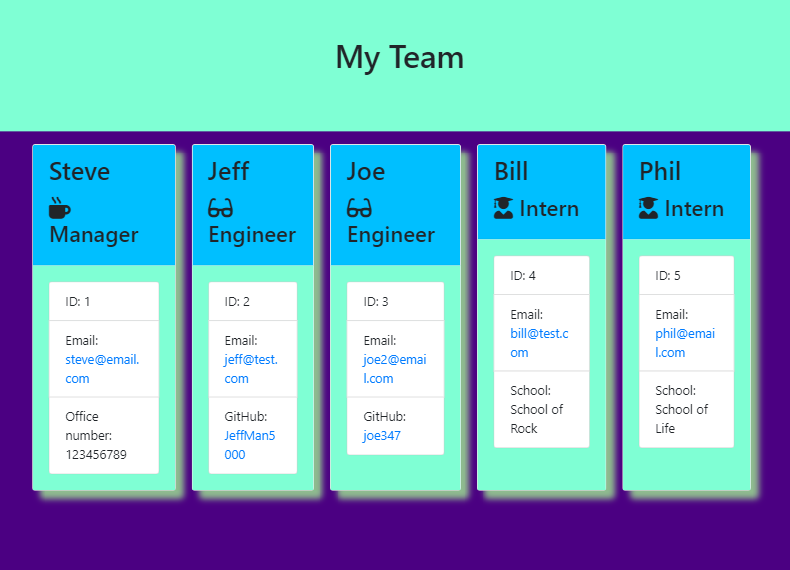

# Team Generator

   ## Description
   This project will automatically generate an html file that displays a team. The team will consist of a single manager, and as many engineers/interns as you determine is needed

   ## Table of Contents
   * [Installation](#Installation)
   * [Usage](#Usage)
   * [Tests](#Tests)
   * [Questions](#Questions)
   
   ## Installation
   To install the necessary dependencies, run the following command in the terminal:
   ```
   npm install
   ```

   ## Usage
   To use this project, run the following command in the terminal:
   ```
   node app.js
   ```
   
   ## Tests
   To test this project, run the commands from the Installation and Usage sections and fill out the prompts with your information

   Here are some screenshots of the working application after testing:

   

   

   

   Here is a link to a wakthrough video of the application during testing:

   https://drive.google.com/file/d/1PO7U2_6yDaFUstWen0xY2zYuPqrL5vel/view?usp=sharing

   ## Questions
   If you have any comments, questions, or concerns about this project, please post them [here](https://github.com/CalebParris/Team-Generator/issues) and I will respond as soon as I am able.

   Otherwise, you can contact me through the following means:
   * Email: calebparris@live.com
   * Github: [CalebParris](https://github.com/CalebParris)
